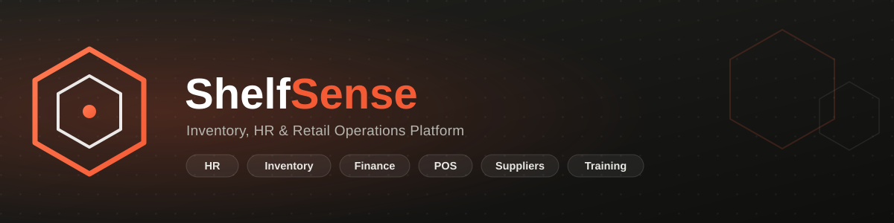

<div align="center">



<br/>


### One backend for the whole shop floor — inventory, hiring, payroll, finance, POS, and suppliers.

[](https://www.php.net/)
[](https://www.mysql.com/)
[](https://getbootstrap.com/)
[](https://developer.mozilla.org/en-US/docs/Web/JavaScript)
[](https://www.apachefriends.org/)

</div>

---

## What is ShelfSense?

**ShelfSense** is a role-based retail operations platform built as a lightweight, dependency-free **PHP MVC** application — no framework, just a small custom router and a clean `app/` structure. It ties together the parts of running a retail business that usually live in five different tools: **hiring, HR, inventory, purchasing, finance, and point-of-sale** — behind one login and one shared design system.

Every role gets its own purpose-built portal, but they all share the same real-time data underneath: a requisition raised by a Store Manager flows to Finance for approval, then to a Supplier for fulfillment, and a trainee hired through the HR pipeline shows up automatically in Payroll and Attendance.

## Portals

| Portal | Who it's for | What it does |
|---|---|---|
| 🧑‍💼 **HR** | HR Staff / HR Head | Applicant pipeline, interviews, contracts, job postings, schedules, attendance review, payroll cycles |
| 📦 **Store Manager** | Store Managers | Inventory levels, stock requisitions, receiving goods |
| 💰 **Finance** | Finance Staff / Finance Head | Requisition & payment approvals, budget tracking |
| 🛒 **POS / Cashier** | Cashiers | Checkout, barcode lookup, order history, daily sales |
| 🚚 **Supplier** | External Suppliers | Incoming requisitions, invoicing, shipping, product catalog |
| 🎓 **Trainee** | Trainees | Rotating dashboard across whichever department (HR / POS / Finance) they're training in, contract acceptance, weekly reports |

Every portal shares one **design system** — a Finexy-inspired shell with a collapsible sidebar, light/dark mode, and consistent components — so switching roles never feels like switching apps.

## Highlights

- **Real hiring-to-payroll pipeline** — applicant → interview → contract → trainee → active employee, with attendance and payroll wired in automatically
- **Cross-department requisitions** — Store Manager → Finance → Supplier, each with their own approval step and status trail
- **Light & dark mode**, persisted per user, on every screen
- **Collapsible, role-aware sidebar navigation** with live badge counts (pending applicants, payment requests, etc.)
- **Chart.js dashboards** per portal — real data, not placeholders
- **PDF/report generation** for payroll and contracts, email delivery via PHPMailer

## Tech Stack

- **Backend:** PHP (no framework — custom `App\Core` router, Auth, Database, Validator, Mailer)
- **Database:** MySQL / MariaDB (PDO)
- **Frontend:** Bootstrap 5.3, Bootstrap Icons, vanilla JavaScript (ES6), Chart.js
- **Mail:** PHPMailer
- **Environment:** XAMPP (Apache + MySQL + PHP)

## Getting Started

### Prerequisites
- [XAMPP](https://www.apachefriends.org/) (or any Apache + MySQL + PHP 8.x stack)
- [Composer](https://getcomposer.org/)

### Setup

```bash
# 1. Clone into your XAMPP htdocs
git clone https://github.com/shelfsenseofficial001-a11y/ShelfSense.git C:/xampp/htdocs/ShelfSense
cd C:/xampp/htdocs/ShelfSense

# 2. Install PHP dependencies
composer install

# 3. Create the database and import the schema
mysql -u root -e "CREATE DATABASE shelfsense"
mysql -u root shelfsense < database/shelfsense.sql
```

Configure your database and mail credentials via environment variables (see `app/config/database.php` and `app/config/mail.php` for the expected keys — `DB_HOST`, `DB_NAME`, `DB_USER`, `DB_PASS`, `MAIL_*`), or rely on the defaults for a stock local XAMPP install (`root` / no password / database `shelfsense`).

Start Apache + MySQL from the XAMPP control panel, then visit:

```
http://localhost/ShelfSense/public/
```

## Project Structure

```
ShelfSense/
├── app/
│   ├── config/        # database.php, mail.php
│   ├── core/           # Router, Auth, Database, Validator, Mailer
│   ├── handlers/        # API endpoints, grouped by portal (hr, finance, pos, supplier, ...)
│   ├── helpers/
│   └── models/
├── database/
│   └── shelfsense.sql   # full schema + seed data
├── public/
│   ├── assets/          # css / js / images
│   └── index.php        # front controller (?page=xxx router)
└── views/
    ├── layouts/          # one layout per portal
    └── pages/            # one folder per portal
```

## License

This project currently has no license file — treat it as all rights reserved unless the repository owner adds one.
